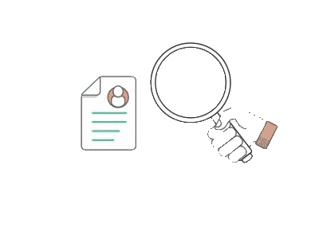
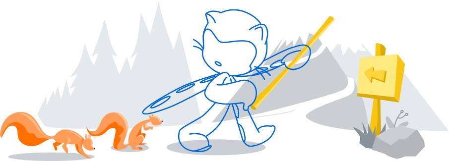
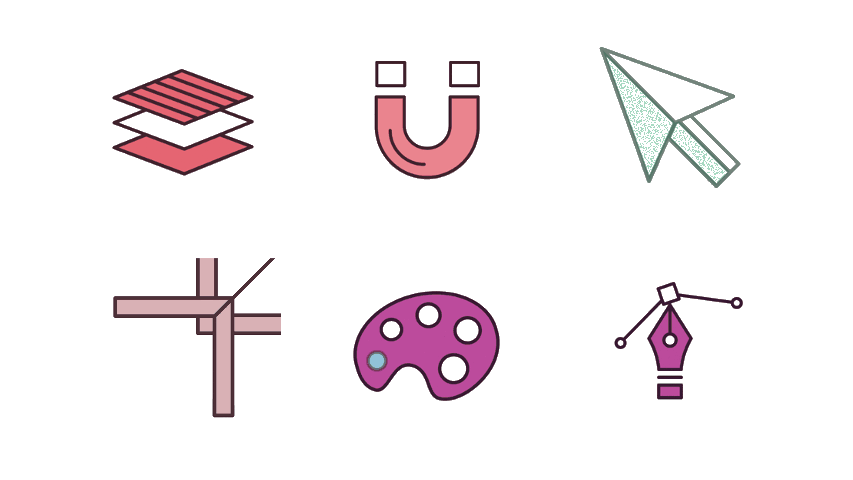
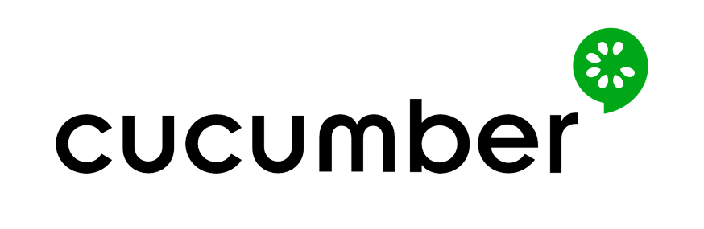
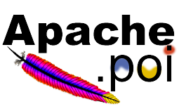

<h1 align="center">Hi 👋, I'm Rutuja</h1>
<h3 align="center">A passionate Software Test Engineer from India</h3>

<h2> About Me </h2>

- 🔭 I’m currently working on **Software Testing Project**

- 🌱 I’m currently learning **Automation Testing**

- 👯 I’m looking to collaborate on **Software Testing Project, Tech Articles**

- 💬 Talk to me about **Software Testing, Manual Testing, Automation Testing**

- 👨‍💻 All of my projects are available at [GitHub Repositories](https://github.com/RutujaPol?tab=repositories)

- 📫 How to reach me **rutujapol174@gmail.com**

   

  

<h2> Connect with me  </h2>

 

 

<!-- <h2> Skills  </h2> -->

<table style="width:100%">
  <tr>
    <th><h2> Skills </h2> </th>
    <th> </th>
  </tr>
  <tr>
    <td>  </td>
    <td>
       &nbsp;&nbsp;&nbsp;&nbsp;
       &nbsp;&nbsp;&nbsp;&nbsp;
       &nbsp;&nbsp;&nbsp;&nbsp;
    </td>
  </tr>
  <tr>
    <td>  </td>
    <td>
       &nbsp;&nbsp;&nbsp;&nbsp;
       &nbsp;&nbsp;&nbsp;&nbsp;
       &nbsp;&nbsp;&nbsp;&nbsp;          
    </td>
  </tr>
    <tr>
    <td>  </td>
    <td>
       &nbsp;&nbsp;&nbsp;&nbsp;
       &nbsp;&nbsp;&nbsp;&nbsp;
       &nbsp;&nbsp;&nbsp;&nbsp;
       &nbsp;&nbsp;&nbsp;&nbsp;  
       &nbsp;&nbsp;&nbsp;&nbsp;            
    </td>
  </tr>
    <tr>
    <td>  </td>
    <td>
       &nbsp;&nbsp;&nbsp;&nbsp;
       &nbsp;&nbsp;&nbsp;&nbsp;
       &nbsp;&nbsp;&nbsp;&nbsp;
    </td>
  </tr>
</table>

    

  &nbsp;&nbsp;&nbsp;&nbsp;

  

<h2> Some Programming Humor for you </h2>

